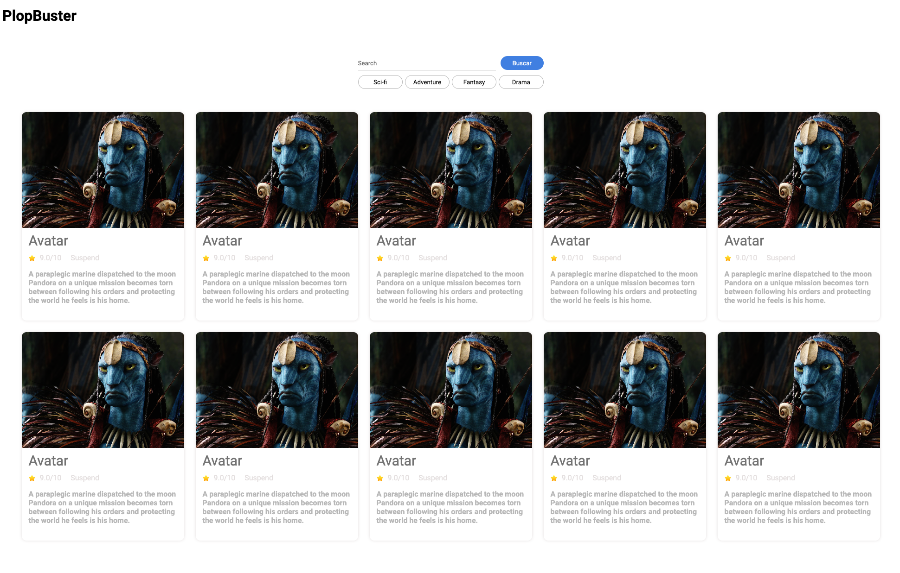

# Challenge #3

La idea principal de este reto es utilizar javascript para darle vida y dinamismo a nuestro sitio web. Para ello, he dividido la actividad en 2 hitos.

## Hitos
### Hito #1
Para esta primera parte deberás hacer uso de los datos presentes en el archivo `data.json` y mostrar la información de las películas que hay en él.
La idea es que generes HTML de forma dinámica utilizando javascript. Al final deberíamos poder ver toda la información de los 16 films presentes en el archivo `data.json`.

#### Consideraciones
- No debes editar los archivos `index.html` y `style.css`. Todo tu trabajo será realizado en el archivo `index.js`.

### Hito #2

Una vez mostremos todos los films, la idea es agregar las dos siguientes funcionalidades utilizando javascript:
- Permitir que el usuario filtre los films dependiendo del género al presionar alguno de los botones que aparecen abajo de la barra de búsqueda. Cada vez que apliquemos un filtro, deberíamos ver el lsitado de films actualizado con los resultados del filtro aplicado.
- Permitir que el usuario pueda buscar un film. Es decir, una vez el usuario ingrese algo en el campo de texto y haga click en el botón buscar, deberíamos ver el listado de films actualizado con los resultados de la búsqueda/filtro.

## Pasos a seguir:

1. Haz un fork de este repositorio
2. Clona el repositorio
3. Corre el proyecto
4. Work work work
## Entregables
- Link del pull request
- Link de github pages
